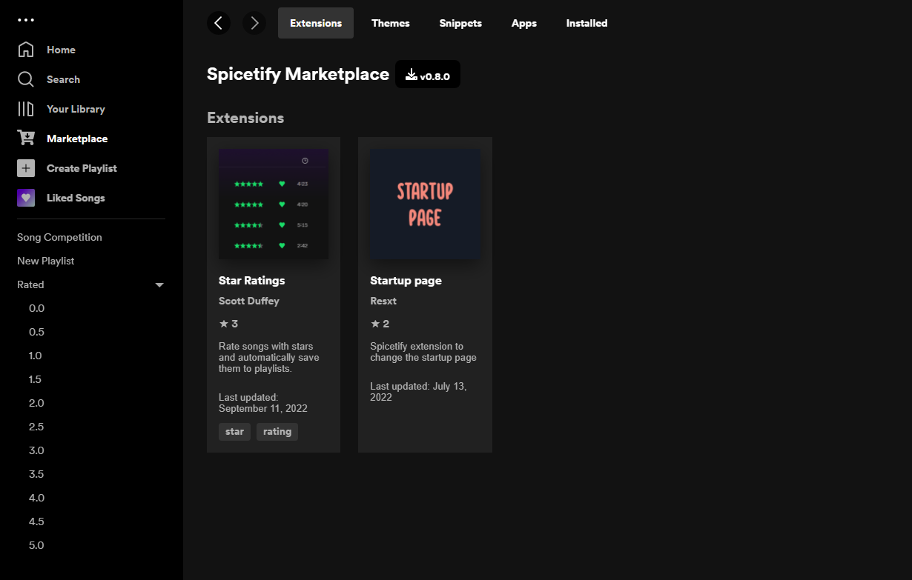

# Spicetify Star Ratings

Add star ratings to Spotify

## Seeking Maintainer

I have since written [Spicetify Playlist Labels](https://github.com/duffey/spicetify-playlist-labels) to suit the way my Spotify usage evolved. If you like this extension, check it out! I no longer use this extension, so I am seeking someone else to take over this repository. In the meantime, I will fix minor bugs and merge pull requests, but I likely won't add new features.

### Spicetify Playlist Labels
I developed [Spicetify Playlist Labels](https://github.com/duffey/spicetify-playlist-labels) because I gradually realized I only wanted to listen to 4-star and above tracks. I only needed a way to distinguish 4 and 5-star tracks. I put the latter in "Favorites." While brainstorming a way to modify this extension, I had the idea for [Spicetify Playlist Labels](https://github.com/duffey/spicetify-playlist-labels), which is a much more flexible system that can be used for more than just rating.

#### Update: Star Playlist Images!
[WildGenius](https://github.com/WildGenius) made some [playlist images](https://github.com/duffey/spicetify-playlist-labels#star-rating-playlist-images) for star ratings to use with [Spicetify Playlist Labels](https://github.com/duffey/spicetify-playlist-labels)!

## Install

1. Install [Spicetify](https://spicetify.app)
2. Install "Star Ratings" from the Marketplace
   

## Settings

Settings, such as enabling/disabling half star ratings, can be accessed from the menu at the top right

## Credits

Thanks to [Tetrax-10](https://github.com/Tetrax-10) for the playlist sorting code